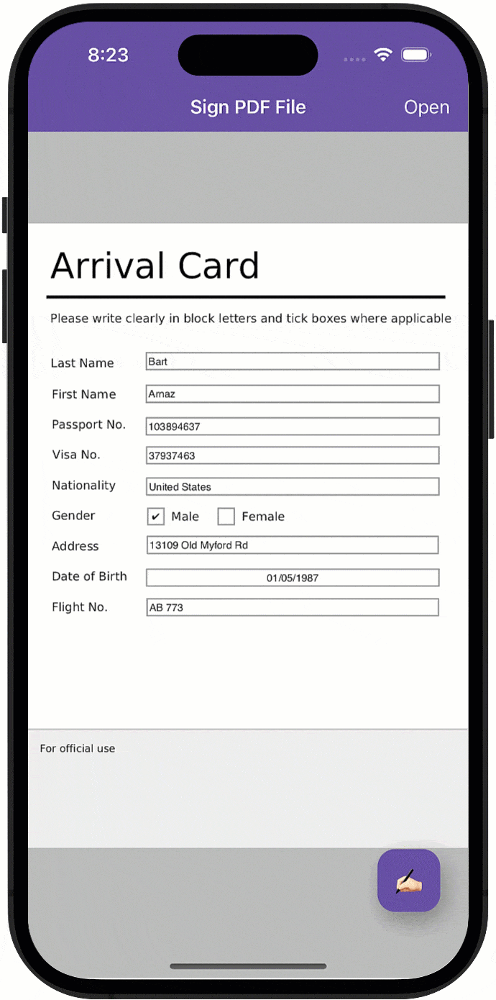

# Use Office File API to Draw a Signature and Sign a PDF File

This project uses the [.NET MAUI Community Toolkit DrawingView](https://learn.microsoft.com/en-us/dotnet/communitytoolkit/maui/views/drawingview#using-the-drawingview) to display a signature pad. This pad allows you to draw your signature and place it in the specified PDF document. After the file is signed, the application shares this file with other applications.



## Implementation Details

> **Note**
>
> PDF-related functionality is included in our [Office File API](https://www.devexpress.com/products/net/office-file-api/) subscription.
>
> To run this example, you need any of the following subscriptions: [DevExpress Universal](https://www.devexpress.com/subscriptions/universal.xml), [DXperience](https://www.devexpress.com/subscriptions/dxperience.xml), [Office File API](https://www.devexpress.com/products/net/office-file-api/), [WinForms](https://www.devexpress.com/products/net/controls/winforms/), [WPF](https://www.devexpress.com/products/net/controls/wpf/), or [ASP.NET](https://www.devexpress.com/subscriptions/asp/).

The [PdfDocumentProcessor](https://docs.devexpress.com/OfficeFileAPI/DevExpress.Pdf.PdfDocumentProcessor) class includes APIs that allow you to manipulate PDF files.

To open and sign a PDF file in a .NET MAUI application, you should copy the PDF and PFX certificate files from the application bundle to a device folder:

```csharp
public async Task<string> CopyWorkingFilesToAppData(string fileName) {
    using Stream fileStream = await FileSystem.Current.OpenAppPackageFileAsync(fileName);
    string targetFile = Path.Combine(FileSystem.Current.AppDataDirectory, fileName);
    using FileStream outputStream = File.OpenWrite(targetFile);
    fileStream.CopyTo(outputStream);
    return targetFile;
}
```

After that, you can use the [PdfDocumentProcessor.LoadDocument](https://docs.devexpress.com/OfficeFileAPI/DevExpress.Pdf.PdfDocumentProcessor.LoadDocument.overloads) method to open the PDF file.

This project calls the [PdfAcroFormFacade.GetFields](https://docs.devexpress.com/OfficeFileAPI/DevExpress.Pdf.PdfAcroFormFacade.GetFields) method to find all the PDF file fields. Once the fields are found, use the [PdfFormFieldFacade.Type](https://docs.devexpress.com/OfficeFileAPI/DevExpress.Pdf.PdfFormFieldFacade.Type) property to get only signature fields. The project signs the first found signature field. 

The [PDFSignatureBuilder](https://docs.devexpress.com/OfficeFileAPI/DevExpress.Pdf.PdfSignatureBuilder) class stores the following information about the signature:

* PFX certificate file
* Location of the person who signs the document
* Name of the person who signs the document
* Reason for signing the document
* Signature image that is embedded in the PDF file

This project uses the [DrawingView](https://learn.microsoft.com/en-us/dotnet/communitytoolkit/maui/views/drawingview#multiline-usage) control to draw a signature. To convert a drawn signature to a JPEG image, the project uses the following code:

```csharp
using Stream origJpgStream = await drawingView.GetImageStream(200, 200);
origJpgStream.Seek(0, SeekOrigin.Begin);
Microsoft.Maui.Graphics.IImage img = PlatformImage.FromStream(origJpgStream, ImageFormat.Jpeg);
var jpegImageBytes = img.AsBytes(ImageFormat.Png);
```

After the document is signed, call the [PdfDocumentProcessor.SaveDocument](https://docs.devexpress.com/OfficeFileAPI/DevExpress.Pdf.PdfDocumentProcessor.SaveDocument.overloads) method to save the signed PDF file.

## Documentation

* [Use Office File API in .NET MAUI Applications (macOS, iOS, Android)](https://docs.devexpress.com/OfficeFileAPI/404423/use-pdf-document-api-in-net-maui-applications?v=23.1)

## More Examples

* [DevExpress .NET MAUI Controls - Send Template Messages with Mail Merge](https://github.com/DevExpress-Examples/maui-mail-merge)
