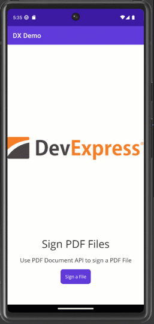

<!-- default badges list -->

<!-- default badges end -->
# DevExpress .NET MAUI Controls - Sign PDF Files

This repository contains the following projects that show how to use PDF Document API in .NET MAUI applications:

* [Sign a PDF File with the Predefined Signature's Location](./CS/1-Get_Started/README.md)
* [Find and Fill Signature Fields](./CS/2-Detect_Signature_Field/README.md)
* [Draw a Signature and Sign a PDF File](./CS/3-Draw_a_Custom_Signature/README.md)

These projects open a file picker to that a user can select a file to sign. After the file is signed, applications share this file with other applications.

> **Note**
>
> The Universal Subscription or an additional Office File API Subscription is required to use this example in production code. Please refer to the following page for pricing information: [DevExpress Subscription](https://www.devexpress.com/Subscriptions/).

## Documentation

* [Use Office File API in .NET MAUI Applications (macOS, iOS, Android)](https://docs.devexpress.com/OfficeFileAPI/404423/use-pdf-document-api-in-net-maui-applications?v=23.1)

## More Examples

* [DevExpress .NET MAUI Controls - Send Template Messages with Mail Merge](https://github.com/DevExpress-Examples/maui-mail-merge)
<!-- feedback -->
## Does this example address your development requirements/objectives?

 

(you will be redirected to DevExpress.com to submit your response)
<!-- feedback end -->
